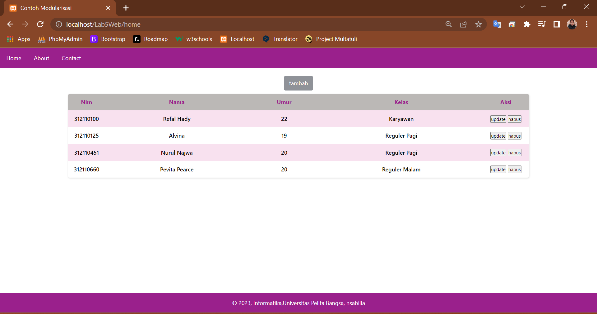
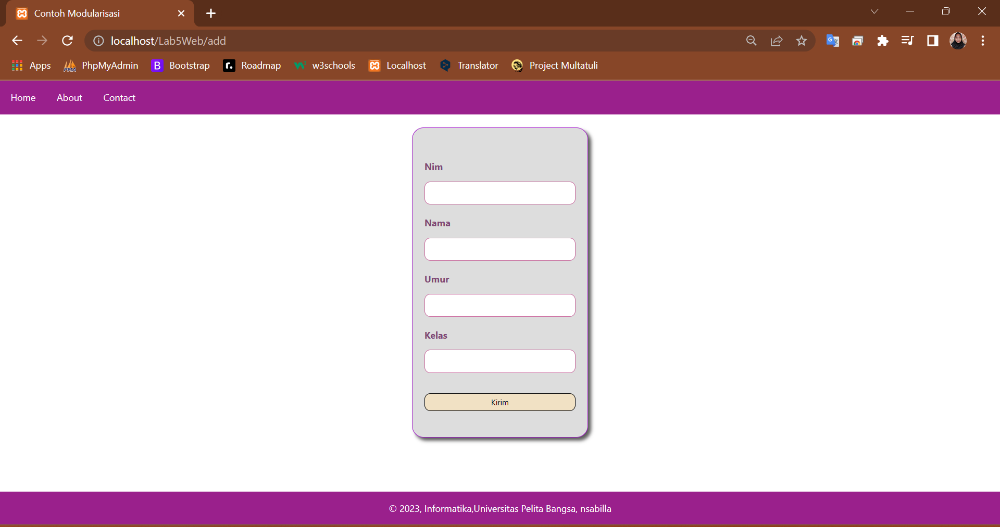
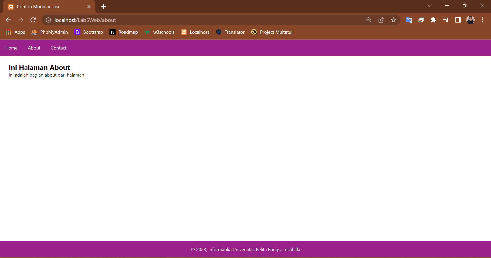
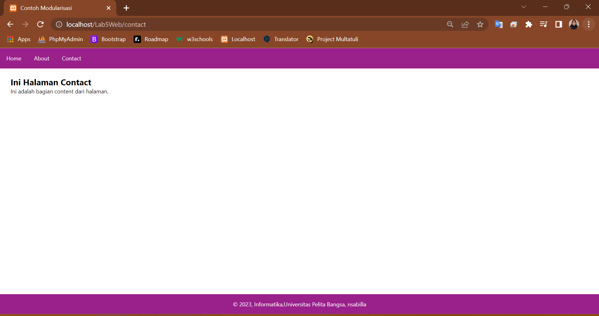

# Praktikum 5: PHP OOP

**<p>Nama: Nurul Najwa Sabilla</p>**
**<p>Kelas: TI.21.A3</p>**
**<p>NIM: 312110451</p>**

# Urutan Pertama Dalam Pengcodingan ini, yaitu:

## Membuat file .htaccess agar url yang user friendly:

## .htaccess

```
<IfModule mod_rewrite.c>
RewriteEngine On
RewriteBase /Lab5Web/
RewriteCond %{REQUEST_FILENAME} !-f
RewriteCond %{REQUEST_FILENAME} !-d
RewriteRule ^(.*)$/?$ index.php?mod=$1 [L,QSA]
</IfModule>
```

## Membuat index.php yang bertujuan sebagai file pertama pada program yang dapat dibaca oleh mesin:

## index.php

```
<?php

require("database.php");
require_once("header.php");
require_once("form.php");

 class Main{
    private $konfig = [];
    public function __construct($namVar)
    {
        $this->konfig=$namVar;
    }
    public function y($main){
        if (array_key_exists($main,$this->konfig)){
            require($this->konfig[$main]);
        }
        else{
            require($this->konfig["home"]);
        }
    }
}

$url=[
    "home"=>"home.php",
    "about"=>"about.php",
    "contact"=>"contact.php",
    "add"=>"add.php",
    "update"=>"update.php",
    "hapus"=>"hapus.php"
];
$istimewa = new main($url);
$istimewa->y(@$_REQUEST["mod"]);
require_once("footer.php");
```

## Memberi database.php untuk menghubungkan pada PhPMyAdmin yang sudah buat:

## database.php

```
<?php
class Database
{
    protected $host;
    protected $user;
    protected $password;
    protected $db_name;
    protected $conn;

    public function __construct()
    {
        $this->getConfig();
        $this->conn = new mysqli(
            $this->host,
            $this->user,
            $this->password,
            $this->db_name
        );
        if ($this->conn->connect_error) {
            die("Connection failed: " . $this->conn->connect_error);
        }
    }
    private function getConfig()
    {
        include_once("config.php");
        $this->host = Config::host;
        $this->user = Config::username;
        $this->password = Config::password;
        $this->db_name = Config::database;
    }
    public function main($table){
        $sql = "SELECT * FROM " . $table;
        $result = $this->conn->query($sql);
        $data = array();
        while ($row = $result->fetch_assoc()) {
            $data[] = $row;
        }
        return $data;
    }
    public function query($sql)
    {
        return $this->conn->query($sql);
    }

    public function get($table, $where)
    {
        $sql = "SELECT * FROM " . $table . " " . $where;
        $sql = $this->conn->query($sql);
        $sql = $sql->fetch_assoc();
        return $sql;
    }

    public function insert($table, $data)
    {
        if (is_array($data)) {
            foreach ($data as $key => $val) {
                $column[] = $key;
                $value[] = "'{$val}'";
            }
            $columns = implode(",", $column);
            $values = implode(",", $value);
        }
        $sql = "INSERT INTO " . $table . " (" . $columns . ") VALUES (" . $values . ")";
        $sql = $this->conn->query($sql);
        if ($sql == true) {
            return $sql;
        } else {
            return false;
        }
    }

    public function update($table, $data, $where)
    {
        $update_value = [];
        if (is_array($data)) {
            foreach ($data as $key => $val) {
                $update_value[] = "$key='{$val}'";
            }
            $update_value = implode(",", $update_value);
        }

        $sql = "UPDATE " . $table . " SET " . $update_value . " WHERE " . $where;
        $sql = $this->conn->query($sql);
        if ($sql == true) {
            return true;
        } else {
            return false;
        }
    }

    public function delete($table, $filter)
    {
        $sql = "DELETE FROM " . $table . " " . $filter;
        $sql = $this->conn->query($sql);
        if ($sql == true) {
            return true;
        } else {
            return false;
        }
    }
}
```

## Membuat config.php untuk menyimpan konfigurasi database di website:

## config.php
```
<?php
class Config
{
    const host = 'localhost';
    const database = "oop_web";
    const username = "root";
    const password = "";
}
```

# Header

## header.php

```
<!DOCTYPE html>
<html lang="en">
<head>
    <meta charset="UTF-8">
    <title>Contoh Modularisasi</title>
    <link href="style.css" rel="stylesheet" type="text/css" />
</head>
<body>
    <div class="container">
        <nav>
            <a href="home">Home</a>
            <a href="about">About</a>
            <a href="contact">Contact</a>
        </nav>
```

# Isi Didalam Header:

## home.php

```
<?php
$database = new Database();
$data = $database->main("tb_lab5web");
?>
<div class="main">
    <a class="tambah" href="add">tambah</a>
    <table>
        <tr>
            <th>Nim</th>
            <th>Nama</th>
            <th>Umur</th>
            <th>Kelas</th>
            <th>Aksi</th>
        </tr>
        <?php
        foreach($data as $row) {
        ?>
            <tr>
            <td><?=$row['nim']; ?></td>
            <td><?=$row['nama']; ?></td>
            <td><?=$row['umur']; ?></td>
            <td><?=$row['kelas']; ?></td>
            <td>
              <a href="update?nim=<?= $row['nim']; ?>"><button>update</button></a>
              <a href="hapus?nim=<?= $row['nim']; ?>"><button>hapus</button></a>
            </td>
            </tr>
        <?php
        }
        ?>
    </table>
</div>
```

## about.php

```
<div class="content">
    <h2>Ini Halaman About</h2>
    <p>Ini adalah bagian about dari halaman</p>
</div>
```

## contact.php

```
<div class="content">
      <h2>Ini Halaman Contact</h2>
  <p>Ini adalah bagian content dari halaman.</p>  
</div>
```

# Isi Didalam Home

## add.php

```
<?php

$database = new Database();
if (isset($_POST['submit'])) {
    $data = [
        'nim' => $_POST['nim'],
        'nama' => $_POST['nama'],
        'umur' => $_POST['umur'],
        'kelas' => $_POST['kelas']
    ];
    $database->insert("tb_lab5web", $data);
}

$form = new Form("", "submit");
$form->addField("nim", "Nim");
$form->addField("nama", "Nama");
$form->addField("umur", "Umur");
$form->addField("kelas", "Kelas");
$form->displayForm();
```

## form.php

```
<?php
class Form
{
    private $fields = array();
    private $action;
    private $submit = "Tambah Form";
    private $jumField = 0;
    public function __construct($action, $submit)
    {
        $this->action = $action;
        $this->submit = $submit;
    }
    public function displayForm()
    {
        echo '<div class="card">';
        echo "<form action='" . $this->action . "' method='POST'>";
        echo '<div class="input">';
        for ($j = 0; $j < count($this->fields); $j++) {
            echo "<label>" . $this->fields[$j]['label'] . "</label>";
            echo "<input type='text' value='" . $this->fields[$j]["value"] . "' name='" . $this->fields[$j]['name'] . "'>";
        }
        echo "<button type='submit' name='" . $this->submit . "'>Kirim</button>";
        echo "</div>";
        echo "</form>";
        echo "</div>";
    }
    public function addField($name, $label, $value = "")
    {
        $this->fields[$this->jumField]['name'] = $name;
        $this->fields[$this->jumField]['label'] = $label;
        $this->fields[$this->jumField]['value'] = $value;
        $this->jumField++;
    }
}
```

# Form Juga Memiliki Button Update dan Hapus

## update.php

```
<?php

$database = new Database();
$nim = $_GET["nim"];

if (isset($_POST['submit'])) {
    $data = [
        'nim' => $_POST['nim'],
        'nama' => $_POST['nama'],
        'umur' => $_POST['umur'],
        'kelas' => $_POST['kelas']
    ];
    $database->update("tb_lab5web", $data, "nim=" . $nim);
    header("location: home");
}

$data = $database->get("tb_lab5web", "where nim=" . $nim);

$form = new Form("", "submit");
$form->addField("nim", "Nim", $data["nim"]);
$form->addField("nama", "Nama", $data["nama"]);
$form->addField("umur", "Umur", $data["umur"]);
$form->addField("kelas", "Kelas", $data["kelas"]);
$form->displayForm();
```

## hapus.php
```
<?php

$database = new Database();
$nim = $_GET["nim"];

if (isset($_GET["nim"])) {
    $database->delete("tb_lab5web", "where nim=" . $nim);
    header("Location: home");
}
```

# Footer

## footer.php

```
        <footer>
        <p>&copy; 2023, Informatika,Universitas Pelita Bangsa, nsabilla</p>
        </footer>
</body>
</html>
```

# OUTPUT ≧◠‿◠≦✌

## Dengan Output Tampilan Home Seperti ini:

Home memiliki 2 tampilan halaman, pada halaman pertama yang dilihat user adalah sebuah table input:



Dan tampilan kedua yaitu halaman tambah data, seperti ini:



## Dengan Output Tampilan About Seperti ini:



## Dengan Output Tampilan Contact Seperti ini:



## THANK A LOT (っ＾▿＾)💨


